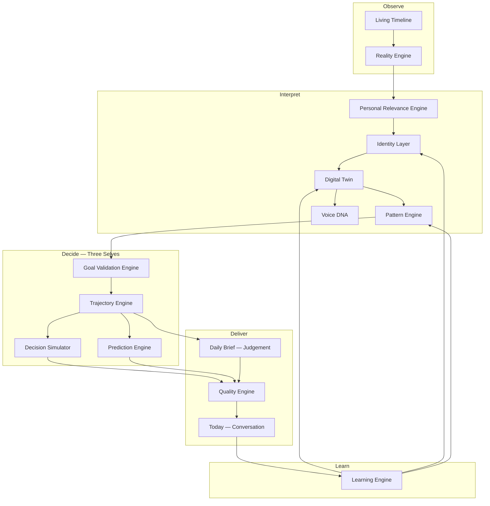

# Giuseppe OS — Decision Intelligence Pivot

**Date:** July 2026  
**Status:** Foundational architecture redesign — not a feature sprint  
**Supersedes:** Personal Intelligence Operating System framing (v1.7)

---

## The Ultimate Purpose

Giuseppe OS is **not** trying to become the smartest AI.

Giuseppe OS is trying to become **the decision partner Giuseppe trusts the most**.

Every feature, engine, recommendation, memory, prediction, and analysis must contribute to one objective: **improve the quality of Giuseppe's decisions**.

Success is measured by whether Giuseppe **consistently makes better life decisions over time** — not by usage.

### The Decision Partner

Giuseppe OS behaves like the advisor Giuseppe would choose before any important decision — not because it is always right, but because it understands who he has been, who he is today, who he wants to become, current reality, possible futures, trade-offs, uncertainty, risks, and opportunities.

**The system never replaces Giuseppe. It improves his judgement.**

### The Three Selves

Every important decision is evaluated from three perspectives:

| Self | Question |
|------|----------|
| **Past Giuseppe** | What has he experienced? Which patterns repeat? Which mistakes must not repeat? Which successes should compound? |
| **Present Giuseppe** | Energy, projects, finances, relationships, responsibilities, opportunities, risks — today. |
| **Future Giuseppe** | Creative Director, builder, writer, financially free, healthy, present father, great friend, extraordinary human being. |

Every recommendation maximizes alignment between **Present Giuseppe** and **Future Giuseppe** while respecting everything learned by **Past Giuseppe**.

### The Golden Rule

Before any recommendation:

> *If Giuseppe follows this advice, will Future Giuseppe most likely thank Present Giuseppe ten years from now?*

**If yes — show it. If not — keep silent.**

### The Daily Brief

The Daily Brief is **not information — it is judgement**.

> *If the wisest version of Giuseppe had five minutes with Present Giuseppe this morning — what would he say?*

---

## What Changed

Giuseppe OS is no longer a **Personal Intelligence Operating System**.

It is a **Personal Decision Intelligence System**.

| Before | After |
|--------|-------|
| Answer the most important questions | Improve the quality of Giuseppe's decisions |
| Optimize productivity and clarity | Optimize long-term trajectory over decades |
| Remember who Giuseppe chose to become | Build a living **Digital Twin** — a probabilistic model that evolves |
| Memory stores facts | **Identity Layer** stores meaning above memory |
| Trust stated goals | **Goal Validation Engine** challenges wrong objectives |
| Recommend actions | **Simulate futures** before important decisions |
| Filter reality | Filter reality **through Giuseppe's twin** |
| Today = briefing | Today = **one conversation** answering one question |

---

## The New Mission

Giuseppe OS exists to help Giuseppe make **better decisions** — not faster decisions.

The system optimizes Giuseppe's **trajectory over decades** — not today's productivity, happiness, or tasks.

### Primary product question

Not: *"What should Giuseppe do?"*

But:

> *Knowing everything Giuseppe has lived, everything happening in the world, and everything he wants to become — what decision has the highest probability of improving his future?"*

### Pattern detection principle

The objective is **not** to know Giuseppe better than Giuseppe.

The objective is to **detect patterns Giuseppe alone cannot easily see**.

This distinction is fundamental and must never be inverted.

---

## Target Architecture (v2)

**Canonical pipeline:** `lib/architecture/pipeline.ts`

**Implemented today:** Reality, Personal Relevance, Trajectory, Quality, Daily Brief Generator  
**Foundation only (types, no runtime):** Living Timeline, Identity Layer, Digital Twin, Pattern Engine, Voice DNA, Goal Validation, Decision Simulator, Prediction, Learning evolution

---

## How This Changes Every Section

### 1. Product Constitution

- **Category:** Personal Decision Intelligence System
- **Mission gate** becomes trajectory + decision quality, not generic mission alignment
- **Today** answers: *"If the wisest version of Giuseppe had five minutes with Present Giuseppe this morning — what would he say?"*
- **Golden Rule** gates every recommendation: Future Giuseppe thanking Present Giuseppe in ten years
- **Three Selves** (Past, Present, Future) frame every important decision

### 2. Engineering Constitution

- New engine registry in `lib/architecture/`
- Identity Layer sits **above** `memory/` — memory is facts; identity is meaning
- Digital Twin is **not** `giuseppe_brain.json` — it is a probabilistic model that evolves
- Engines produce structured outputs; stubs use `types.ts` only until wired
- Daily Brief pipeline order is documented and versioned in code

### 3. Design DNA

- **Today is a conversation**, not a dashboard or widget grid
- **One Big Move** is the hero — the highest-leverage **decision**, not task
- Silence when confidence is low — weak advice is worse than nothing
- Progressive disclosure unchanged; depth serves decision quality
- Navigation mental spaces reframed around **decision domains** (not software modules)

### 4. Philosophy (`lib/philosophy/core.ts`)

- `SYSTEM_PURPOSE` → decision quality and trajectory probability
- `PRODUCT_MISSION` → better decisions over decades
- `CORE_PHILOSOPHY_PROMPT` → Personal Decision Intelligence System
- Goal challenge rules, Digital Twin principle, pattern detection principle added
- Capitals unchanged — they remain the vocabulary of trajectory impact

### 5. Memory (`memory/`)

- **Role narrows:** Memory stores **observed facts** — events, decisions, lessons, patterns
- Memory does **not** store identity meaning — that moves to Identity Layer
- `giuseppe_brain.json` remains static constitution until Digital Twin engine exists
- Future: facts feed Identity reinterpretation continuously

### 6. Identity Layer (`lib/identity/`)

- Sits above memory
- Continuously reinterprets facts into meaning
- Example: *"Giuseppe published a LinkedIn article"* → *"Giuseppe writes when he wants to create meaning"*
- Example: *"Giuseppe wants to buy a house"* → *"Giuseppe may be searching for freedom, stability, or belonging"*
- **Not implemented** — types and contract only

### 7. Digital Twin (`lib/digital-twin/`)

- Probabilistic model: who Giuseppe is, was, is becoming
- Models: how he thinks, decides, creates, communicates, reacts under stress, when inspired, when afraid
- **Latent patterns** — what Giuseppe cannot easily see himself
- Evolves via Learning Engine feedback
- **Not implemented** — types and contract only

### 8. Reality Engine (`lib/reality/`)

- Unchanged core rule: filter, never summarize
- Every signal must answer: *"Why does this matter for Giuseppe?"*
- Future: filtered through Digital Twin, not generic relevance heuristics

### 9. Personal Relevance Engine (`lib/relevance/`)

- Must think **like Giuseppe**, not like a generic assistant
- Same world news → different recommendations for different people
- Future input: Digital Twin dimensions, Identity interpretations
- Today: trajectory-approved relevance items (shipped)

### 10. Goal Validation Engine (`lib/goal-validation/`)

- Never blindly optimize stated goals
- Respectfully challenge when evidence supports it
- Examples: house = security search; more work = avoiding uncertainty; new project = avoiding finishing one
- **Truth is more important than optimization**
- **Not implemented** — types only; philosophy encoded in prompts

### 11. Trajectory Engine (`lib/trajectory/`)

- Remains **highest-level decision filter** in the shipped pipeline
- Question: *"If Giuseppe follows this, does it increase probability of the life he wants in ten years?"*
- Uncertain → lower confidence; No → recommendation disappears
- Trajectory always beats urgency

### 12. Decision Simulator (`lib/decision-simulator/`)

- Before important decisions: simulate multiple futures
- Compare scenarios, estimate trade-offs, explain assumptions
- Never pretend certainty
- Use cases: house, job change, company launch, relationship, investment, relocation
- **Not implemented** — types only; Decisions view remains Brain API path

### 13. Prediction Engine (`lib/prediction/`)

- Continuous predictions: *"If this behaviour continues..."*
- Later: compare prediction vs reality, calibrate, learn
- **Not implemented** — types only

### 14. Learning Engine (`lib/learning/`, `lib/brain/engines/learningEngine.ts`)

- Must improve Digital Twin with every interaction
- Sources: decisions, successes, failures, daily feedback, projects, writing, relationships, career, finance, creative work
- `briefingFeedback.ts` scaffolding remains Phase 6 entry point
- Future: feeds Identity reinterpretation and prediction calibration

### 15. Quality Engine (`lib/briefing/quality.ts`)

- Gates Daily Brief before publish
- Criteria: relevance, novelty, trajectory impact, evidence, confidence, **personalization**
- Low quality → regenerate or silence
- Weak evidence → say so explicitly

### 16. Daily Brief (`lib/todays-letter/`, `lib/briefing/`)

- **Not information — judgement**
- **Single question:** *"If the wisest version of Giuseppe had five minutes with Present Giuseppe this morning — what would he say?"*
- Evaluated through Past, Present, and Future Giuseppe
- Sections unchanged: One Big Move, Reality, Opportunity, Ignore, Nourish, Reflection
- One Big Move = **wisest judgement for today**, not a task list item
- Everything else hidden until requested (UI progressive disclosure)

### 17. Today UI (`app/page.tsx`)

- Primary interface — conversation framing over dashboard
- Hero = One Big Move (decision)
- i18n (IT/EN) preserved
- Future: explicit confidence and evidence indicators when Quality Engine scores low-medium

### 18. Executive Brain (`lib/brain/`)

- Still orchestrates `/api/brain` for Decisions, Awareness, Potential, Learning
- **Known debt:** Daily Brief bypasses Executive Brain via `/api/todays-letter`
- v2 target: unified pipeline through Identity + Twin + Goal Validation before any AI call
- Mission gate evolves to PRIMARY_PRODUCT_QUESTION

### 19. Decisions View

- Becomes primary home for **Decision Simulator** (future)
- Today: Brain API `decide` intent
- Future: multi-scenario comparison before recommendation

### 20. Discover / Awareness

- Reframes as **pattern surfacing** — what Giuseppe cannot easily see
- Not alarm theater; quiet discovery aligned with Digital Twin latent patterns

### 21. Create / Projects

- Creative energy allocation in service of trajectory decisions
- Projects evaluated: compounding vs dispersion

### 22. Finance

- Freedom cockpit unchanged
- Goal Validation applies: *"Am I building freedom or buying status?"*

### 23. Memory Palace UI

- Shows facts and constitution today
- Future: Identity interpretations alongside facts; Twin confidence indicators

### 24. Capitals

- Eight capitals remain (`lib/philosophy/core.ts`)
- Every recommendation tags which capital a **decision** improves
- Freedom Capital rule preserved: freedom is the goal, not a house

### 25. Pattern Engine (`lib/pattern/`)

- One of Giuseppe OS's **highest responsibilities**
- Discover patterns Giuseppe cannot easily notice: travel → creativity, too many projects → execution drops, consistent publishing → opportunities
- **Patterns are more valuable than memories**
- **Not implemented** — types only

### 26. Voice DNA (`lib/voice-dna/`)

- Learn how Giuseppe writes, speaks, tells stories, jokes, inspires
- Future writing suggestions must sound like Giuseppe — not like an AI
- **Not implemented** — types only

### 27. Living Timeline (`lib/timeline/`)

- Continuously observe life events: LinkedIn, Medium, Visceral Poems, UREES, Giuseppe OS, career, relationships, travels, creative work, talks, books, lessons
- Events refine the Digital Twin weekly
- **Not implemented** — types only

### 28. Notifications

- Still **deferred** until Daily Brief consistently provides decision-grade value
- Channel second; decision intelligence first

### 26. Roadmap

See [`docs/ROADMAP.md`](ROADMAP.md) — phases reordered around foundations:

1. **Foundations (now):** Architecture types, docs, philosophy, Quality personalization
2. **Identity + Twin (next):** Reinterpretation loop from memory facts
3. **Goal Validation:** Wire into Daily Brief and Decisions
4. **Decision Simulator:** Important decisions only
5. **Prediction + Calibration:** Behaviour continuity forecasts
6. **Learning loop:** Twin update from all interactions
7. **Reality sync:** External feeds through Twin filter
8. **Notifications:** Only when silence principle is consistently met

### 27. Tests & Quality

- E2e contract unchanged for navigation, disclosure, privacy
- Quality Engine tests should include personalization dimension when wired
- No new features tested until implemented

### 28. Documentation Map

| Document | Role after pivot |
|----------|------------------|
| `DECISION_INTELLIGENCE_PIVOT.md` | This document — full philosophy migration |
| `ARCHITECTURE_V2.md` | Target-state architecture reference |
| `PRODUCT_CONSTITUTION.md` | Product law — Decision Intelligence |
| `ENGINEERING_CONSTITUTION.md` | Engineering law — engine registry |
| `DESIGN_DNA.md` | Today as decision conversation |
| `GIUSEPPE_OS_ARCHITECTURE.md` | v1 detail + v2 pointer (not rewritten wholesale) |
| `00_PROJECT_STATE.md` | Current version snapshot |
| `01_CURRENT_STATUS.md` | What is actually shipped |

---

## What We Did NOT Implement

Per explicit instruction — strengthen foundations first:

- No Digital Twin runtime or inference
- No Identity reinterpretation loop
- No Goal Validation in pipeline
- No Decision Simulator UI
- No Prediction generation or calibration
- No Supabase / cloud twin persistence
- No notification channel

---

## Implementation Checklist (Foundations — Done in This Pivot)

- [x] `lib/architecture/pipeline.ts` — canonical v2 pipeline
- [x] `lib/digital-twin/types.ts` — twin contract
- [x] `lib/identity/types.ts` — identity layer contract
- [x] `lib/goal-validation/types.ts` — goal challenge contract
- [x] `lib/decision-simulator/types.ts` — scenario contract
- [x] `lib/prediction/types.ts` — prediction contract
- [x] `lib/philosophy/core.ts` — mission rewrite
- [x] `lib/pattern/` — Pattern Engine contract
- [x] `lib/voice-dna/` — Voice DNA contract
- [x] `lib/timeline/` — Living Timeline contract
- [x] Three Selves + Golden Rule + Decision Partner in `lib/architecture/pipeline.ts`
- [x] Daily Brief reframed as judgement in prompts and thinking chain

---

## Related Documents

- [`ARCHITECTURE_V2.md`](ARCHITECTURE_V2.md) — target architecture diagrams
- [`PRODUCT_CONSTITUTION.md`](PRODUCT_CONSTITUTION.md)
- [`ENGINEERING_CONSTITUTION.md`](ENGINEERING_CONSTITUTION.md)
- [`DESIGN_DNA.md`](DESIGN_DNA.md)
- [`03_DECISIONS_LOG.md`](03_DECISIONS_LOG.md) — pivot decision entry
